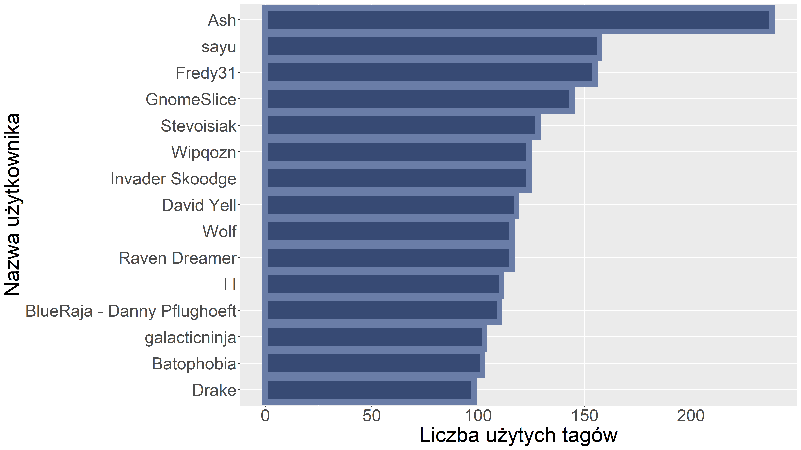
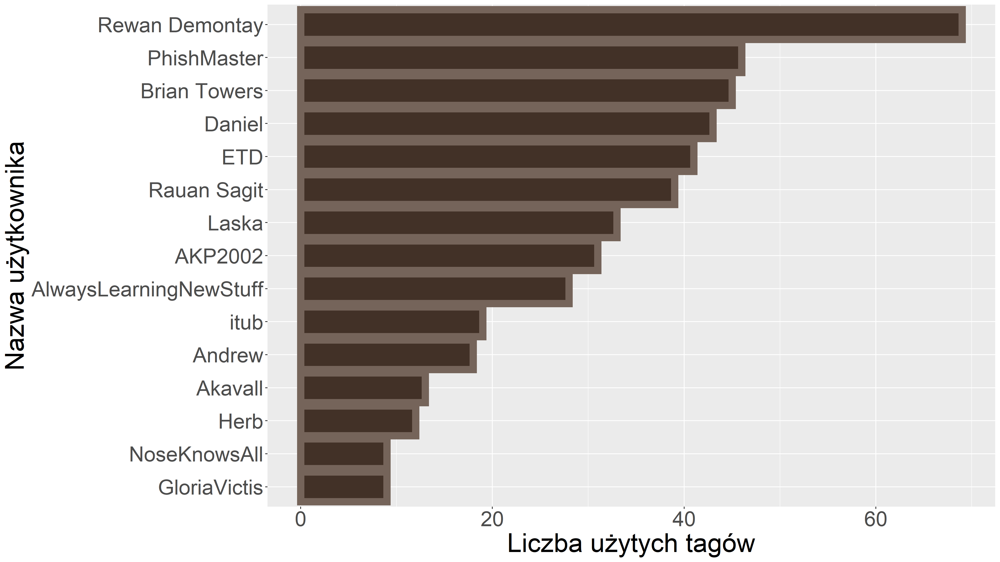
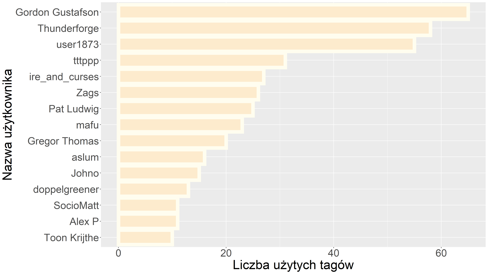
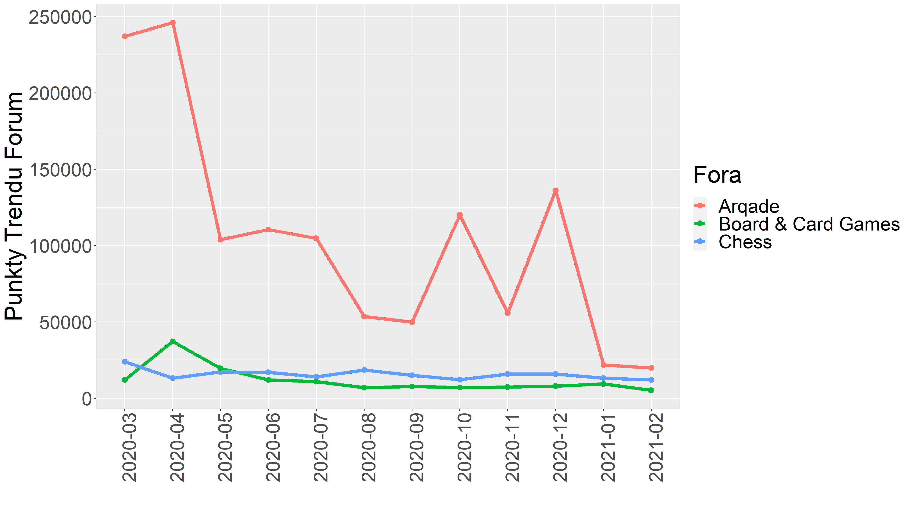

```{r setup, include=FALSE}
knitr::opts_chunk$set(echo = TRUE, cache = TRUE, warning = FALSE, message = FALSE)
sizeR <- 30
```
```{r Main, include=FALSE}
source("Main.R")
```

##  Spis treści  ##

**Zapytania**

 1. [Jak zmieniała się popularność gier na przestrzeni miesięcy?](#zapytanie-1)
 2. [Wybór 15 najaktywniejszych użytkowników forum *Arqade*](#zapytanie-2)
 3. [Jak serial *Gambit Królowej* wpłynął na popularyzację szachów?](#zapytanie-3)
 4. [Porównanie popularności wybranych serwisów: *Arqade*, *Chess*, *Board & Card Games*](#zapytanie-4)  

##  Wstęp  ##


##  Zapytanie 1  ##
**Jak zmieniała się popularność gier na przestrzeni miesięcy?**

```{r one, include=FALSE}
wynik <- tags_trends(arqade.Posts)
ggplot(data = wynik, aes(x = wynik[,get(names(wynik)[1])],y = wynik[,get(names(wynik)[3])], color = wynik[,get(names(wynik)[2])])) + 
geom_point(size = 4) +
theme(axis.text.x = element_text(angle = 90, vjust = 0.8, hjust = 1.2), ) +
labs(x = "",  y = "Liczba wystąpień tagu", color = "Nazwy tagów") +
theme(text = element_text(size = 20)) 


ggsave("tags_trends.png", height = 9, width = 16)
```


##  Zapytanie 2  ##
**Wybór 15 najaktywniejszych użytkowników forum Arqade**

```{r two, include=FALSE}
w_arqade <- tags_users_comparision(arqade.Posts, arqade.Users)
w_chess <- tags_users_comparision(chess.Posts, chess.Users)
w_boarding <- tags_users_comparision(boarding.Posts, boarding.Users)
 
draw <- function(w, name, c1, c2){
  ggplot(data = w, aes(x =         reorder(w[,get(names(w)[1])],w[,get(names(w)[4])]),y = w[,get(names(w)[4])])) + 
geom_col(fill = c1, color = c2,size = 4) +
coord_flip() +
labs(x = "",  y = "") +
theme(text = element_text(size = sizeR)) 
ggsave(paste(name,".png", sep=""), height = 9, width = 16)
}
draw(w_arqade, "Arqade", "#374A74", "#6A7DA7")
draw(w_chess, "Chess", "#423127", "#75645A")
draw(w_boarding, "Boarding", "#fdebcd", "#fffdef")
```


##  Zapytanie 2  ##
**Wybór 15 najaktywniejszych użytkowników forum Chess**


##  Zapytanie 2  ##
**Wybór 15 najaktywniejszych użytkowników forum Board & Card Games**


##  Zapytanie 3  ##
**Jak serial *Gambit Królowej*^[Serial Netflix'a (2020), reż. Scott Frank, Allan Scott] wpłynął na popularyzację szachów?**
```{r tree, include=FALSE}
wynik <- queens_gambit1(chess.Posts)
ggplot(wynik, aes(x=Data, y=V, colour=Color, group=G))+
geom_line(show.legend = FALSE, size = 4)+
geom_point(show.legend = FALSE, size = 4)+
labs(x = "",  y = "Liczba pytań / odpowiedzi", color = "Nazwy tagów") +
theme(text = element_text(size = sizeR))+
annotate(geom = "text", x = 4, y = 280, label = "Odpowiedzi", size = 12)+
annotate(geom = "text", x = 4, y = 125, label = "Pytania", size = 12)

ggsave("queens_gambit.png", height = 9, width = 16)
```


##  Zapytanie 4  ##
**Nasz zajebisty wzór <3**
$$
  \gamma(x) = \left\{ \begin{array}{ll}
\frac{ViewCount}{Score} & \textrm{jeśli $Score \neq 0$}\\
\frac{ViewCount}{Score+1} & \textrm{jeśli $Score = 0$}\\
\end{array} \right.
$$


$$
  Punkty Trendu(x) = \left\{ \begin{array}{ll}
Score & \textrm{jeśli $x$ jest odpowiedzią}\\
\gamma(x) & \textrm{jeśli $x$ nie jest odpowiedzią}\\
\end{array} \right.
$$

$$
  Punkty Trendu Forum(y) = \sum_{i = w_1}^{w_n} Punkty Trendu(i) 
$$
gdzie: 

* $w_i$ to i-ty wiersz ramki Posts z serwisu y;
* $i\in[n]$; 
* $n$ - liczba wierszy ramki Posts z serwisu y.


##  Zapytanie 4  ##
**Porównanie popularności wybranych serwisów: *Arqade*, *Chess*, *Board & Card Games* **
```{r four, include=FALSE}
wynik <- do.call(rbind,list(trends(chess.Posts,"chess"), trends(arqade.Posts,"arqade"), trends(boarding.Posts,"boarding")))
ggplot(wynik, aes(x=Date, y=Points, colour=Group, group=Group))+
geom_line(size = 2)+
geom_point(size = 3)+
theme(axis.text.x = element_text(angle = 90, vjust = 0.8, hjust = 1.2), ) +
labs(x = "",  y = "Punkty Trendu Forum", color = "Fora") +
theme(text = element_text(size = sizeR))

ggsave("trends.png", height = 9, width = 16)
```


^^^^^^^^^NNRŁP
