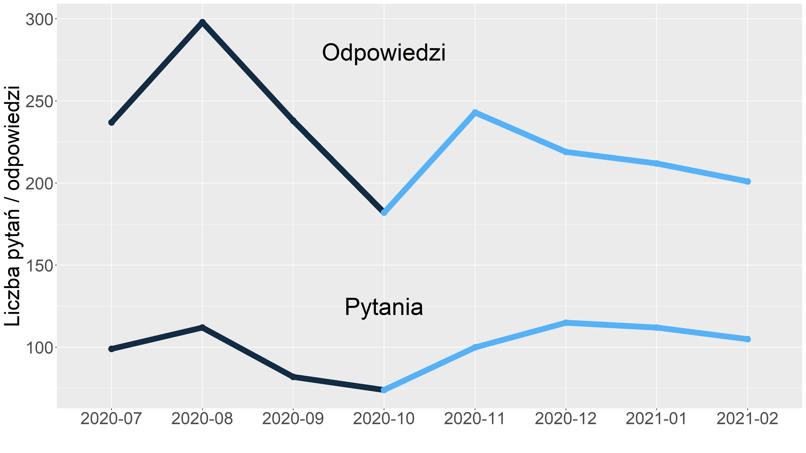

```{r setup, include=FALSE}
knitr::opts_chunk$set(echo = TRUE, cache = TRUE, warning = FALSE, message = FALSE)
```
```{r Main, include=FALSE}
source("Main.R")
```

##  Zapytanie 1  ##
**Jak zmieniała się popularność gier na przestrzeni miesięcy?**

```{r one, include=FALSE}
wynik <- tags_trends(arqade.Posts)
ggplot(data = wynik, aes(x = wynik[,get(names(wynik)[1])],y = wynik[,get(names(wynik)[3])], color = wynik[,get(names(wynik)[2])])) + 
geom_point(size = 4) +
theme(axis.text.x = element_text(angle = 90, vjust = 0.8, hjust = 1.2), ) +
labs(x = "",  y = "Liczba wystąpień tagu", color = "Nazwy tagów") +
theme(text = element_text(size = 20)) 


ggsave("tags_trends.png", height = 9, width = 16)
```


##  Zapytanie 2  ##
**Wybór 15 najaktywniejszych użytkowników forum Arqade**

```{r two, include=FALSE}
w_arqade <- tags_users_comparision(arqade.Posts, arqade.Users)
w_chess <- tags_users_comparision(chess.Posts, chess.Users)
w_boarding <- tags_users_comparision(boarding.Posts, boarding.Users)
 
draw <- function(w, name){
  ggplot(data = w, aes(x =         reorder(w[,get(names(w)[1])],w[,get(names(w)[4])]),y =   w[,get(names(w)[4])])) + 
geom_col(size = 4) +
coord_flip() +
labs(x = "",  y = "") +
theme(text = element_text(size = 20)) 
ggsave(paste(name,".png", sep=""), height = 9, width = 16)
}
draw(w_arqade, "Arqade")
draw(w_chess, "Chess")
draw(w_boarding, "Boarding")
```


##  Zapytanie 2  ##
**Wybór 15 najaktywniejszych użytkowników forum Chess**


##  Zapytanie 2  ##
**Wybór 15 najaktywniejszych użytkowników forum Board & Card Games**


##  Zapytanie 3  ##
**Jak serial *Gambit Królowej*^[Serial Netflix'a (2020), reż. Scott Frank, Allan Scott] wpłynął na popularyzację szachów?**
```{r tree, include=FALSE}
wynik <- queens_gambit(chess.Posts)
ggplot(data = wynik[[1]], aes(x = wynik[[1]][,get(names(wynik[[1]])[1])],y = wynik[[1]][,get(names(wynik[[1]])[2])])) + 
geom_col(size = 4) +
labs(x = "",  y = "Liczba wystąpień tagu", color = "Nazwy tagów") +
theme(text = element_text(size = 20)) 

ggsave("queens_gambit.png", height = 9, width = 16)
```

